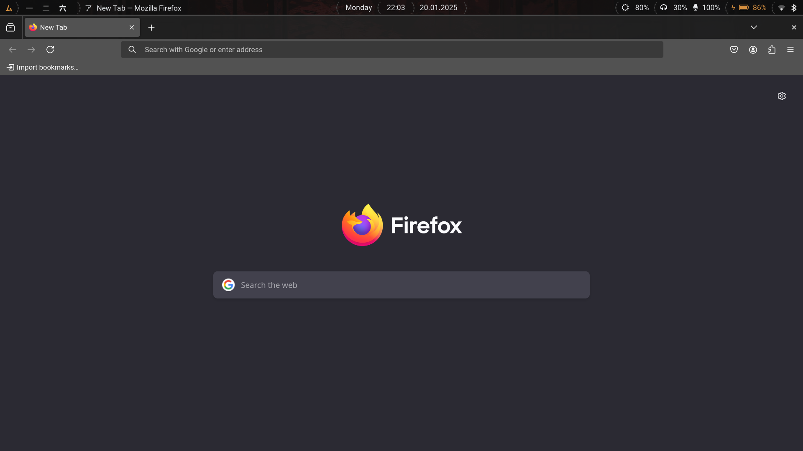

<h1 align=center>Amatsagu Dotfiles</h1>

<div align="center">
<a href="#gallery">Gallery</a> - <a href="#install">Install</a> - <a href="#usage">Usage</a> - <a href="#credit">Credit</a>
<br>
┗━ <a href="https://www.reddit.com/r/unixporn/comments/1d9r6a8/sway_like_falling_petals_and_flowing_water/">See reddit thread</a> ━┛
</div>

<h1></h1>


- Linux distro - **Debian 12**
- Tiling manager - **Sway**
- GTK theme - **Adwaita (dark)**
- Icon theme - **Papirus (dark)**
- Cursor theme - **Phinger cursors (dark)**
- Color theme - **Gnome shell**
- Fonts - **Noto Sans, Awesome Fonts, Roboto, FiraCode**
- Terminal - **Foot**
- Text editor - **Nano**
- File manager - **Nemo**
- Status bar - **Waybar**
- App menu - **Fuzzel**
- Notifications - **Mako**
- Session control - **Wlogout**
- Audio server - **Pipewire** + **Pavucontrol**
- Bluetooth manager - **Blueman**
- Connection manager - **Network manager**

## Gallery

<br><br>

<br><br>

<br><br>

<br><br>


## Install

This installation script is built to hopefully make the installation process easier for you. I cannot guarantee that it will work; you may run into issues. If something is missing and/or doesn't work, I would recommend reading over the installation script. Keep in mind that those dotfiles were created primarily for my usage so it's expected. After installation, you'll probably want to check `.config/sway` config to set valid screen scale for your monitor or change some keybinds (I use mostly default ones).

Now, if you use other distro than Debian 12 (bookworm), you're out of luck - you can still make it work but you'll need to open [setup/packages.sh](https://github.com/amatsagu/dotfiles/blob/master/setup/packages.sh) script and manually install all used themes, fonts & apps. For Debian users, there's automatic script to assist you - install fresh system with just minimal packages (uncheck gnome or any other desktop during installation), clone this repository & run installation script; feel free to copy & paste below commands:
```sh
sudo apt update && sudo apt upgrade -y
sudo apt install git -y
git clone https://github.com/amatsagu/dotfiles.git
cd ./dotfiles
chmod +x ./install.sh
./install.sh
```
After that, just type `sway` to enter your new desktop :)

## Usage

### Keybinds
Check sway documentation, all keybinds are set to default. By default, Mod key is Windows logo [Mod4].

### Session control (wlogout)
You can click golden gate icon in top left corner on waybar or press `Mod + Shift + E` keys.

### Applications
By default, script will only prepare `nano` for quick text file edits, `nemo` to manage files & `pavucontrol` to control speakers & microphone(s). This desktop tries to only use Wayland, there's no xwayland, if you need it, do `sudo apt install xwayland` and restart computer.

I've prepared few tiny installation scripts for common apps, check `./app/install`; applications installed this way will have modified their desktop entries to work on native Wayland. Common problem right now is that a lot of applications can work on Wayland but by default will crash searching X server, you can usually change that by adding flags at launch, forcing wayland mode. Also, apps installed with my scripts will add official source lists so they'll use latest version even through we're on Debian (updating with apt later also works).

Caution! Some applications like Visual Studio Code or Google Chrome are known from re-installing their desktop entries after every update, so you'll need to copy back custom desktop entry to make it work again with wayland, this sucks but I failed to find any solution to this (for now). *(check ./app/desktop)*

### Wifi?
Open terminal and type `nmtui` to display graphical configuration of network manager.

### Screen scalling
By default it'll use 1.0 (100%) scale which is fine for average 1920x1080, 23-24'' monitor but for sure it'll look bad on hidpi screens or on smaller laptops. Check your `.config/sway/config` to edit screen display preferences.

## Credit
- Wallpaper created by [Kanta](https://x.com/kantakerro/status/1656664039978852352)
- Pavucontrol & Electron config made by [@Kacper-Kondracki](https://github.com/Kacper-Kondracki)
