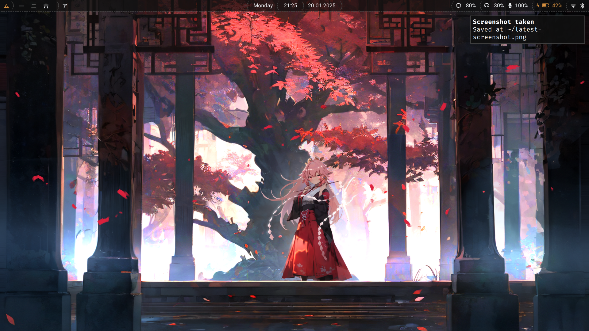

<h1 align=center>Amatsagu Dotfiles</h1>

<div align="center">
<a href="#gallery">Gallery</a> - <a href="#install">Install</a> - <a href="#usage">Usage</a> - <a href="#credit">Credit</a>
<br>
┗━ <a href="https://www.reddit.com/r/unixporn/comments/1d9r6a8/sway_like_falling_petals_and_flowing_water/">See OG reddit thread</a> ━┛
</div>

<h1></h1>


- Linux distro - **Debian 13**
- Tiling manager - **Sway**
- GTK theme - **Fluent (dark)**
- Icon theme - **Papirus (dark)**
- Cursor theme - **Phinger cursors (dark)**
- Color theme - **Gnome shell**
- Fonts - **Noto Sans, Awesome Fonts, FiraCode, Roboto**
- Terminal - **Foot**
- Text editor - **Nano**
- File manager - **Thunar**
- Status bar - **Waybar**
- App menu - **Fuzzel**
- Notifications - **Mako**
- Session control - **Wlogout**
- Audio server - **Pipewire**
- Bluetooth manager - **Blueman**
- Connection manager - **Network manager**

## Gallery

<br><br>

<br><br>

## Install

This installation script is built to hopefully make the installation process easier for you. I cannot guarantee that it will work; you may run into issues. If something is missing and/or doesn't work, I would recommend reading over the installation script. Keep in mind that those dotfiles were created primarily for my usage so it's expected. After installation, you'll probably want to check `.config/sway` config to set valid screen scale for your monitor or change some keybinds (I use mostly default ones).

Now, if you use other distro than Debian 12 (bookworm), you're out of luck - you can still make it work but you'll need to open [setup/packages.sh](https://github.com/amatsagu/dotfiles/blob/master/setup/packages.sh) script and manually install all used themes, fonts & apps. For Debian users, there's automatic script to assist you - install fresh system with just minimal packages (uncheck gnome or any other desktop during installation), clone this repository & run installation script; feel free to copy & paste below commands:
```sh
git clone https://github.com/amatsagu/dotfiles.git
cd ./dotfiles
chmod +x ./install.sh
./install.sh
```
After that, it's recommended to restart your computer. After that - type `sway` to enter your new desktop :)

## Usage

### Keybinds
Check sway documentation, all keybinds are set to default. By default, Mod key is Windows logo [Mod4].

### Session control (wlogout)
You can click golden gate icon in top left corner on waybar or press `Mod + Shift + E` keys.

## Credit
- Wallpaper created by [Re Eʟy (@Elyzerda)](https://x.com/elyzerda/status/1833474305729921168?t=Au0iDGAeCAdQdHbwjKoD_Q)
